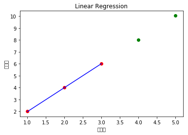
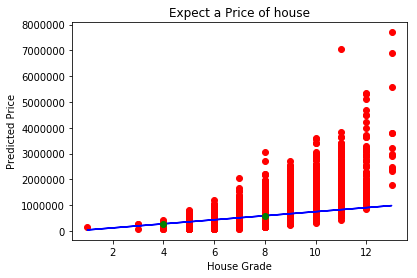

# 선형 회귀 모델 구현하기

## 선형회귀란?

### 선형 회귀: Linear Regression

- x 와 y값을 가지고 서로간의 관계를 파악하는것.
- 어떠한 입력에 대해서 출력값을 예측하는것.
- 머신러닝의 기본.
- 지도학습(Supervised Learning) 예측 문제에 사용하는 알고리즘.
- 선형회귀는 기본적으로 설명변수와 반응변수가 연속형 변수일 때 사용할수 있다.
- 만약 설명변수가 범주형 변수인 경우, 이를 더미변수 (Dummy Variable)로 변환하여 회귀분석을 적용해야 한다.

### 손실 함수: Loss Function

- 한 쌍(x, y)의 데이터에 대한 손실값을 계산하는 함수.
- 손실값이란 실제값과 모델로 예측한 값이 얼마나 차이가 나는가 이다.
- 즉 손실값이 작을수록 그 모델이 X 와 Y의 관계를 잘 설명하고 있다는 것.
- 이 손실을 전체 데이터에 대해 구한 경우 이를 비용(cost)이라고 한다.

손실 함수는 '예측값과 실제값의 거리'를 가장 많이 사용한다.
따라서 손실값은 예측값에서 실제값을 뺀뒤 제곱하여, 모든 데이터에 대한 평균을 내어 구한다.

이 손실함수를 만들때에는 잔차의 개념이 도입된다.

### 잔차: Residual

- 잔차란 관측값의 y와 예측값의 y 간의 차이를 말한다.
- 잔차 = hypothesis - y (여기서 hypothesis = W \* X + b, y는 예측값.)

```
A(1, 4) B(2, 3) 2개의점이 있다. 회귀식 = 2x + 1
A의 관측값 y는 4 예측값 y는 3
B의 관측값 y는 3, 예측값 y는 5

이때 A의 잔차는 4 - 3 = 1
B의 잔차는 3 - 5 = -2 이다
```

### 최소 제곱법: method of least squares, least squares approximation

최소 제곱법은 잔차의 제곱의 합이 최소가 되도록 하는 직선을 회귀선으로 한다는 것을 의미.

```
(hypothesis - 예측값) ** 2 -> 최소로 한다.
위에서 최소 제곱법으로 나온 값은 = (1) ** 2 + (-2) ** 2 = 5.
```

### 최적화 함수

- 가중치(W: Weight)와 편향(b: bias)값을 변경해가면서 손실값을 최소화 하는 가장 최적화된 가중치와 편향값을 찾아주는 함수.
- 값들을 무작위로 변경할시, 시간이 너무 오래걸리고, 학습 시간도 예측하기 어려울것.
- 따라서 빠르게 최적화 하기위한 다양한 방법 사용.

### 경사하강법: 최적화 방식중 하나

- 경사하강법은 최적화 방법중 가장 기본적인 알고리즘 으로, 함수의 기울기르루 구하고, 기울기가 낮은쪽으로 계속 이동시키면서 최적의 값을 찾아가는 방법
- Learning Rate, 즉 학습률은 학습을 얼마나 급하게 할것인가를 설정하는 값.
- 러닝 레이트가 너무 크면 최적의 손실갑슬 찾지 못하고 지나치게 되고, 너무 작으면 학습 속도가 매우 느려진다.

### 하이퍼 파라미터: hyperparameter

- 위의 Learning Rate처럼 학습에 영향을 주는 변수를 하이퍼 파라미터 라고 한다.
- 이 값에 따라 학습속도나 신경망 성능이 크게 달라진다.

`linear-regression-tf.py`

```python
# $ conda install tensorflow
# $ conda install matplotlib

import tensorflow as tf
import matplotlib.pyplot as plt

x_data = [1, 2, 3]
y_data = [2, 4, 6]

# 위와 같은 두배의 값을 규칙으로 하는 값들이 있다고 하자.

# y = W * X + b
# 출력값 = 가중치 * 입력값 + 편향

W = tf.Variable(tf.random_normal([1], -1., 1.))
b = tf.Variable(tf.random_normal([1], -1., 1.))

# 가중치와 편향 값을 랜덤하게 하나를 뽑는 작업.

X = tf.placeholder(tf.float32)
Y = tf.placeholder(tf.float32)

# x_data와 y_data의 값을 담을 플레이스홀더를 선언.

hypothesis = W * X + b

# 위의 식을 바탕으로 hypothesis 라는 식 선언
# X와 W가 행렬이 아니므로 tf.matmul이 아니라 기본 곱셈 연산자를 사용.

# 손실함수 작성 : 잔차의 최소 제곱법을 적용한후 모든 데이터에 대한 손실값의 평균을 내어 구한것.
# 잔차 = hypothesis - y
# tf.square(잔차) -> 잔차의 최소 제곱법을 적용
# tf.reduce_mean(tf.square(잔차)) -> 잔차의 최소 제곱법을 적용한후 모든 데이터에 대한 손실값의 평균을 내어 구한것.
cost = tf.reduce_mean(tf.square(hypothesis - Y))

# 경사 하강법 최적화 함수를 이용해 손실값을 최소화 하는 연산 그래프 생성.
# 최적화 함수
optimizer = tf.train.GradientDescentOptimizer(learning_rate=0.1)
train_op = optimizer.minimize(cost)

with tf.Session() as sess:
    sess.run(tf.global_variables_initializer())

    for step in range(100):
        _, cost_val = sess.run([train_op, cost], feed_dict={
                               X: x_data, Y: y_data})

        print(step, cost_val, sess.run(W), sess.run(b))
        # 여기서 찍힌 값을 보면, step이 늘어날수록, 손실값은 작아지는 것을 볼수 있다.

    prediction_X_4 = sess.run(hypothesis, feed_dict={X: 4})
    prediction_X_5 = sess.run(hypothesis, feed_dict={X: 5})
    print("X: 5 일때 예측값 Y:", prediction_X_4)
    print("X: 10 일때 예측값 Y:", prediction_X_5)

    plt.figure(1)
    plt.title('Linear Regression')
    plt.xlabel('입력값')
    plt.ylabel('출력값')
    # x_data와 y_data를 기준으로 점을 찍는다.
    plt.plot(x_data, y_data, 'ro')
    # 예측한 일차함수를 선으로 표시
    plt.plot(x_data, sess.run(W) * x_data + sess.run(b), 'b')
    # x = 5 일때 초록점 찍기
    plt.plot([4], prediction_X_4, 'go')
    # x = 10 일때 초록점 찍기
    plt.plot([5], prediction_X_5, 'go')

```

결과

```
0 42.470684 [2.4284465] [-0.22302985]
1 0.52415997 [2.1177752] [-0.3498025]
2 0.022300875 [2.1477726] [-0.3269521]
3 0.015544206 [2.1406324] [-0.3206707]
4 0.014737797 [2.1376438] [-0.3127895]
5 0.014036932 [2.1342921] [-0.30528915]
6 0.013370161 [2.1310685] [-0.29794815]
7 0.01273507 [2.127917] [-0.2907859]
8 0.012130133 [2.1248422] [-0.28379554]
9 0.01155397 [2.121841] [-0.2769733]
10 0.011005126 [2.118912] [-0.27031505]
11 0.010482387 [2.1160536] [-0.26381683]
12 0.009984459 [2.1132636] [-0.2574749]
13 0.009510189 [2.1105409] [-0.25128537]
14 0.009058433 [2.1078835] [-0.24524464]
15 0.00862817 [2.1052902] [-0.2393491]
16 0.008218323 [2.102759] [-0.23359534]
17 0.007827944 [2.1002886] [-0.22797982]
18 0.007456124 [2.0978777] [-0.22249934]
19 0.007101948 [2.0955248] [-0.21715058]
20 0.006764582 [2.0932286] [-0.21193036]
21 0.0064432784 [2.0909872] [-0.20683575]
22 0.0061372 [2.0888002] [-0.20186348]
23 0.0058456827 [2.0866654] [-0.19701086]
24 0.0055680103 [2.084582] [-0.19227485]
25 0.005303502 [2.0825489] [-0.18765269]
26 0.0050515966 [2.0805643] [-0.1831417]
27 0.0048116376 [2.0786276] [-0.17873904]
28 0.0045830896 [2.0767374] [-0.17444226]
29 0.0043653883 [2.0748928] [-0.17024876]
30 0.0041580102 [2.0730925] [-0.16615608]
31 0.0039605093 [2.0713353] [-0.16216184]
32 0.0037723917 [2.0696204] [-0.15826361]
33 0.0035932038 [2.0679467] [-0.15445904]
34 0.0034225248 [2.0663133] [-0.15074593]
35 0.003259943 [2.0647192] [-0.14712206]
36 0.003105099 [2.0631635] [-0.14358532]
37 0.0029575967 [2.061645] [-0.14013366]
38 0.0028171048 [2.0601633] [-0.13676494]
39 0.0026832952 [2.058717] [-0.13347723]
40 0.002555849 [2.0573053] [-0.1302686]
41 0.0024344374 [2.0559278] [-0.12713702]
42 0.0023187972 [2.0545833] [-0.12408071]
43 0.0022086473 [2.0532713] [-0.12109789]
44 0.0021037406 [2.0519905] [-0.11818682]
45 0.0020038097 [2.0507407] [-0.11534566]
46 0.0019086379 [2.049521] [-0.11257282]
47 0.0018179723 [2.0483305] [-0.10986665]
48 0.0017316194 [2.0471687] [-0.10722556]
49 0.0016493658 [2.0460348] [-0.10464794]
50 0.0015710144 [2.0449283] [-0.10213227]
51 0.0014963896 [2.0438483] [-0.09967712]
52 0.001425319 [2.042794] [-0.09728102]
53 0.0013576051 [2.0417655] [-0.09494241]
54 0.0012931268 [2.0407612] [-0.09266011]
55 0.0012317062 [2.0397813] [-0.09043261]
56 0.0011731881 [2.0388253] [-0.08825859]
57 0.0011174673 [2.0378919] [-0.086137]
58 0.0010643912 [2.0369809] [-0.08406635]
59 0.0010138314 [2.0360918] [-0.08204543]
60 0.00096566504 [2.0352242] [-0.08007307]
61 0.00091980613 [2.0343773] [-0.07814816]
62 0.00087610446 [2.033551] [-0.07626946]
63 0.0008344829 [2.0327446] [-0.07443593]
64 0.00079485815 [2.0319571] [-0.07264663]
65 0.000757093 [2.0311892] [-0.07090017]
66 0.00072113913 [2.0304394] [-0.06919584]
67 0.0006868792 [2.0297077] [-0.06753244]
68 0.00065424625 [2.0289936] [-0.06590898]
69 0.00062317564 [2.0282965] [-0.06432464]
70 0.0005935691 [2.0276163] [-0.06277829]
71 0.00056536996 [2.0269525] [-0.06126911]
72 0.0005385172 [2.0263045] [-0.05979627]
73 0.0005129425 [2.0256722] [-0.05835882]
74 0.0004885812 [2.025055] [-0.05695596]
75 0.0004653704 [2.0244527] [-0.05558674]
76 0.0004432618 [2.023865] [-0.05425046]
77 0.00042221425 [2.023291] [-0.05294639]
78 0.00040214974 [2.0227313] [-0.05167355]
79 0.0003830522 [2.0221848] [-0.05043137]
80 0.00036485636 [2.0216515] [-0.04921905]
81 0.0003475259 [2.021131] [-0.04803585]
82 0.00033101955 [2.020623] [-0.04688111]
83 0.0003152896 [2.0201273] [-0.04575405]
84 0.00030031707 [2.0196433] [-0.04465417]
85 0.00028604764 [2.0191712] [-0.04358065]
86 0.0002724634 [2.0187104] [-0.04253303]
87 0.00025952377 [2.0182605] [-0.0415106]
88 0.00024719306 [2.0178216] [-0.04051268]
89 0.00023545395 [2.017393] [-0.0395388]
90 0.00022426603 [2.0169752] [-0.03858828]
91 0.00021361478 [2.016567] [-0.03766069]
92 0.00020346681 [2.0161688] [-0.03675534]
93 0.00019380315 [2.01578] [-0.03587181]
94 0.0001845964 [2.0154006] [-0.03500943]
95 0.0001758262 [2.0150306] [-0.0341678]
96 0.00016747485 [2.0146692] [-0.03334647]
97 0.00015951767 [2.0143166] [-0.03254483]
98 0.00015194587 [2.0139723] [-0.0317625]
99 0.00014472575 [2.0136366] [-0.0309989]
X: 5 일때 예측값 Y: [8.023547]
X: 10 일때 예측값 Y: [10.037184]

```



## kaggle 실습

https://www.kaggle.com/harlfoxem/housesalesprediction/version/1
위 링크로 들어가서 csv 파일을 하나 다운받는다.
Go Above Link, Download a csv file.

집 등급으로 집값을 예측해 볼것이다.
Our goal is to expect the price of the house by grade.

`expect_house_price_by_grade.py`

```python
import tensorflow as tf
import numpy as np
import matplotlib.pyplot as plt

data = np.genfromtxt('./kc_house_data.csv', dtype=float,
                     delimiter=',', names=True)

# print(data['price'], data['grade'])


grade_arr = data['grade']
price_arr = data['price']


W = tf.Variable(tf.random_normal([1], -1., 1.))
b = tf.Variable(tf.random_normal([1], -1., 1.))

X = tf.placeholder(tf.float32)
Y = tf.placeholder(tf.float32)

hypothesis = W * X + b

cost = tf.reduce_mean(tf.square(hypothesis - Y))

optimizer = tf.train.GradientDescentOptimizer(learning_rate=0.01)
train_op = optimizer.minimize(cost)

with tf.Session() as sess:
    sess.run(tf.global_variables_initializer())

    for step in range(100):
        _, cost_val = sess.run([train_op, cost], feed_dict={
                               X: grade_arr, Y: price_arr})

        print(step, cost_val, sess.run(W), sess.run(b))

    print("grade가 4일때, price 예측값:", sess.run(hypothesis, feed_dict={X: 4}))
    print("grade가 8일때, price 예측값:", sess.run(hypothesis, feed_dict={X: 8}))

    plt.figure(1)
    plt.title('Expect a Price of house')
    plt.xlabel('House Grade')
    plt.ylabel('Predicted Price')
    # x_data와 y_data를 기준으로 점을 찍는다.
    plt.plot(grade_arr, price_arr, 'ro')
    # 예측한 일차함수를 선으로 표시
    plt.plot(grade_arr, sess.run(W) * grade_arr + sess.run(b), 'b')
    # x = 5 일때 초록점 찍기
    plt.plot([4], sess.run(hypothesis, feed_dict={X: 4}), 'go')
    # x = 10 일때 초록점 찍기
    plt.plot([8], sess.run(hypothesis, feed_dict={X: 8}), 'go')


```

결과 값

```
0 426480370000.0 [88468.45] [10799.96]
1 116564270000.0 [69103.89] [7837.8906]
2 101578090000.0 [73434.02] [7900.5015]
3 100831945000.0 [72557.6] [7298.7544]
4 100773540000.0 [72825.195] [6843.255]
5 100748260000.0 [72841.38] [6355.887]
6 100724630000.0 [72912.77] [5875.7876]
7 100701135000.0 [72972.01] [5394.3574]
8 100677440000.0 [73033.87] [4913.485]
9 100654105000.0 [73095.125] [4432.7563]
10 100630660000.0 [73156.484] [3952.2622]
11 100607110000.0 [73217.78] [3471.9817]
12 100583600000.0 [73279.06] [2991.9194]
13 100560175000.0 [73340.305] [2512.074]
14 100536890000.0 [73401.53] [2032.4474]
15 100513464000.0 [73462.73] [1553.0371]
16 100490215000.0 [73523.88] [1073.8434]
17 100466700000.0 [73585.03] [594.8689]
18 100443540000.0 [73646.13] [116.109375]
19 100420270000.0 [73707.22] [-362.43225]
20 100396880000.0 [73768.27] [-840.7571]
21 100373684000.0 [73829.3] [-1318.8656]
22 100350484000.0 [73890.305] [-1796.7568]
23 100327170000.0 [73951.266] [-2274.4329]
24 100303950000.0 [74012.22] [-2751.8906]
25 100280850000.0 [74073.13] [-3229.1335]
26 100257750000.0 [74134.016] [-3706.1602]
27 100234540000.0 [74194.88] [-4182.969]
28 100211474000.0 [74255.72] [-4659.563]
29 100188365000.0 [74316.52] [-5135.9414]
30 100165480000.0 [74377.305] [-5612.1035]
31 100142380000.0 [74438.055] [-6088.0503]
32 100119420000.0 [74498.77] [-6563.7812]
33 100096290000.0 [74559.48] [-7039.296]
34 100073390000.0 [74620.14] [-7514.5967]
35 100050510000.0 [74680.78] [-7989.681]
36 100027480000.0 [74741.4] [-8464.55]
37 100004650000.0 [74801.984] [-8939.204]
38 99981660000.0 [74862.54] [-9413.644]
39 99958840000.0 [74923.07] [-9887.867]
40 99935860000.0 [74983.58] [-10361.876]
41 99913180000.0 [75044.055] [-10835.671]
42 99890290000.0 [75104.5] [-11309.251]
43 99867530000.0 [75164.92] [-11782.616]
44 99844810000.0 [75225.32] [-12255.767]
45 99821890000.0 [75285.68] [-12728.703]
46 99799286000.0 [75346.02] [-13201.425]
47 99776500000.0 [75406.336] [-13673.932]
48 99753930000.0 [75466.62] [-14146.226]
49 99731240000.0 [75526.88] [-14618.305]
50 99708666000.0 [75587.11] [-15090.171]
51 99685980000.0 [75647.31] [-15561.822]
52 99663460000.0 [75707.484] [-16033.261]
53 99640860000.0 [75767.63] [-16504.484]
54 99618310000.0 [75827.76] [-16975.494]
55 99595700000.0 [75887.85] [-17446.291]
56 99573190000.0 [75947.92] [-17916.875]
57 99550650000.0 [76007.95] [-18387.246]
58 99528080000.0 [76067.97] [-18857.404]
59 99505760000.0 [76127.95] [-19327.35]
60 99483330000.0 [76187.914] [-19797.082]
61 99460860000.0 [76247.84] [-20266.602]
62 99438580000.0 [76307.75] [-20735.908]
63 99416150000.0 [76367.625] [-21205.002]
64 99393750000.0 [76427.47] [-21673.883]
65 99371410000.0 [76487.3] [-22142.55]
66 99349110000.0 [76547.09] [-22611.008]
67 99326730000.0 [76606.86] [-23079.252]
68 99304325000.0 [76666.6] [-23547.285]
69 99282215000.0 [76726.31] [-24015.105]
70 99259980000.0 [76786.] [-24482.713]
71 99237870000.0 [76845.66] [-24950.11]
72 99215620000.0 [76905.3] [-25417.293]
73 99193490000.0 [76964.9] [-25884.266]
74 99171270000.0 [77024.48] [-26351.027]
75 99149180000.0 [77084.02] [-26817.578]
76 99127070000.0 [77143.555] [-27283.916]
77 99104920000.0 [77203.055] [-27750.043]
78 99082854000.0 [77262.52] [-28215.959]
79 99060785000.0 [77321.96] [-28681.664]
80 99038660000.0 [77381.38] [-29147.156]
81 99016740000.0 [77440.77] [-29612.44]
82 98994730000.0 [77500.13] [-30077.512]
83 98972740000.0 [77559.47] [-30542.373]
84 98950700000.0 [77618.78] [-31007.023]
85 98928840000.0 [77678.06] [-31471.463]
86 98907005000.0 [77737.32] [-31935.693]
87 98885110000.0 [77796.55] [-32399.713]
88 98863120000.0 [77855.75] [-32863.523]
89 98841300000.0 [77914.92] [-33327.12]
90 98819510000.0 [77974.08] [-33790.508]
91 98797650000.0 [78033.195] [-34253.688]
92 98775880000.0 [78092.29] [-34716.656]
93 98754060000.0 [78151.36] [-35179.414]
94 98732460000.0 [78210.4] [-35641.965]
95 98710610000.0 [78269.41] [-36104.305]
96 98688800000.0 [78328.4] [-36566.434]
97 98667135000.0 [78387.36] [-37028.355]
98 98645480000.0 [78446.3] [-37490.066]
99 98623930000.0 [78505.2] [-37951.57]
grade가 4일때, price 예측값: [276069.25]
grade가 8일때, price 예측값: [590090.06]
```



다른 따져볼것들이 많아서 단순히 grade만으로 price를 예측하면 오차가 너무많다.

I think this is not a good sample data for simple linear regression..

그러나 결과는 나왔다.

But the result has been extracted.
